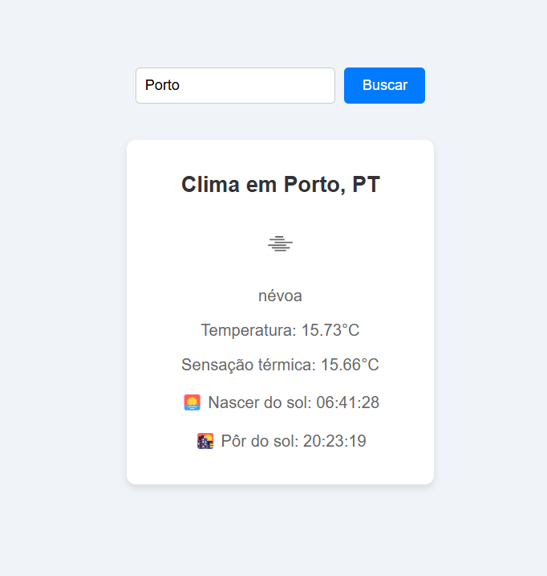

# 🌤️ WeatherApp - React Project

This is a simple weather forecast project built with React, using the OpenWeatherMap API. It was created with a focus on practicing modern React concepts like the useState and useEffect hooks, using fetch for asynchronous calls, and styling with CSS Modules.**.

## ✨ Features

✅ Search current weather by city
📍 View country and city
🌡️ Temperature and feels like
🌅 Sunrise time
🌇 Sunset time
🌦️ Dynamic icon based on weather condition
🔴 Error message for invalid city
🎨 Clean and responsive UI with CSS Modules

## 🚀 Technologies Used

- React  
- JavaScript (ES6+)  
- Vite  
- CSS Modules  
- OpenWeatherMap API  

## 📷 Preview



## 💻 Como Rodar o Projeto

```bash
# Clone the repository
git clone https://github.com/diasmurillo/WeatherApp.git

# Navigate to the project folder
cd WeatherApp

# Install the dependencies
npm install

# Start the development server
npm run dev


